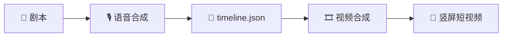

# 🎬 AIBLI

> 虚拟角色音视频合成管线 — 从剧本到带字幕短视频的一站式自动化工具

[](https://python.org)
[](https://github.com/RVC-Boss/GPT-SoVITS)
[](https://github.com/Zulko/moviepy)
[](LICENSE)

 **Hi there!** 欢迎使用 AIBLI —— 让虚拟角色开口说话的自动化工具。


---

## ✨ 功能特性

| 模块 | 能力 |
|------|------|
| 🎙️ **语音合成** | 基于 GPT-SoVITS，多角色对话音频一键生成 |
| 🎞️ **视频合成** | 基于 MoviePy 2.x，角色立绘 + 字幕 + 音频自动合成 |
| 📱 **竖屏输出** | 9:16 格式（1080×1920），适配短视频平台 |
| 🎨 **角色定制** | 支持多角色人设、声线、字幕样式独立配置 |
| 🔗 **桥接协作** | 音频团队与视频团队通过统一 timeline.json 协作 |

---

## 🏗️ 项目架构

```
AIBLI/
├── 🎙️ audio_synthesis/          # 语音合成管线
│   ├── audio_synthesis_pipeline.py  # 主入口
│   ├── character_profile/    # 角色配置（人设、参考音频）
│   ├── scripts/              # 剧本文件
│   └── README.md             # 音频模块说明
│
├── 🎞️ video_stitcher/           # 视频合成工具
│   ├── src/                  # 核心源码
│   │   ├── main.py           # 主程序
│   │   ├── core/             # 视频/字幕/音频混合
│   │   └── utils/            # 工具函数
│   ├── characters/           # 角色字幕样式配置
│   ├── docs/                 # 文档
│   ├── requirements.txt      # Python 依赖
│   └── README.md             # 视频模块说明
│
└── 🔗 pipeline/                 # 桥接文件/中间产物
```

---

## 🚀 快速开始

### 1. 环境准备

| 依赖 | 用途 | 安装方式 |
|------|------|---------|
| **GPT-SoVITS** | 语音合成引擎 | [官方仓库](https://github.com/RVC-Boss/GPT-SoVITS) |
| **MoviePy 2.x** | 视频合成 | `pip install moviepy` |
| **Python 3.9+** | 运行时 | — |

### 2. 安装项目依赖

```bash
cd video_stitcher
pip install -r requirements.txt
```

### 3. 配置角色

在对应目录放置角色素材：

```
audio_synthesis/character_profile/{角色名}/
├── personality.txt      # 角色人设描述
├── ref_audio/sample.wav # 参考音频样本
├── {角色名}.ckpt        # GPT 模型权重
└── {角色名}.pth         # SoVITS 模型权重

video_stitcher/characters/{角色名}/profile/
├── subtitle_style.json  # 字幕样式配置
└── avatar/photo.png     # 角色立绘（封面用）
```

### 4. 运行工作流

```bash
# 1. 准备剧本 → audio_synthesis/scripts/

# 2. 语音合成
python audio_synthesis/audio_synthesis_pipeline.py

# 3. 视频合成
python video_stitcher/src/main.py
```

---

## 📋 工作流程



1. **编写剧本** — 在 `audio_synthesis/scripts/` 下创建对话剧本
2. **生成音频** — 运行语音合成管线，输出各角色音频
3. **时间线生成** — 自动输出 `timeline.json` 与合并音频
4. **合成视频** — `video_stitcher` 读取时间线，生成带字幕竖屏视频

---

## 🛠️ 技术栈

- **语音合成**: GPT-SoVITS (v2)
- **视频合成**: MoviePy 2.x
- **字幕渲染**: 自定义字幕样式系统
- **音频混合**: 桥接模式音频处理
- **输出格式**: MP4 (H.264), 1080×1920, 9:16

---

## 📂 仓库内容

本仓库包含：
- ✅ 语音合成与视频合成的核心源码
- ✅ 角色配置模板与人设文本
- ✅ 字幕样式配置系统
- ✅ 剧本格式规范与示例
- ✅ 项目文档与使用说明

运行时所需的模型权重、参考音频、角色立绘等素材请按上述目录结构自行准备。

---

## 🎮 作者其他项目

<details>
<summary>👇 点击展开查看更多</summary>

| 项目 | 类型 | 状态 |
|------|------|------|
| 🍺 **魔物酒馆模拟RPG** | Godot 游戏 | 开发中 |
| 🎰 **刮刮乐彩票游戏** | Godot 原型 | 已完成 |
| 🎬 **AIBLI** | AI 音视频工具 | 已完成 |

> 游戏开发者 · AI 创作者 · 独立工作室

</details>

---

## 📄 License

[MIT](LICENSE)
